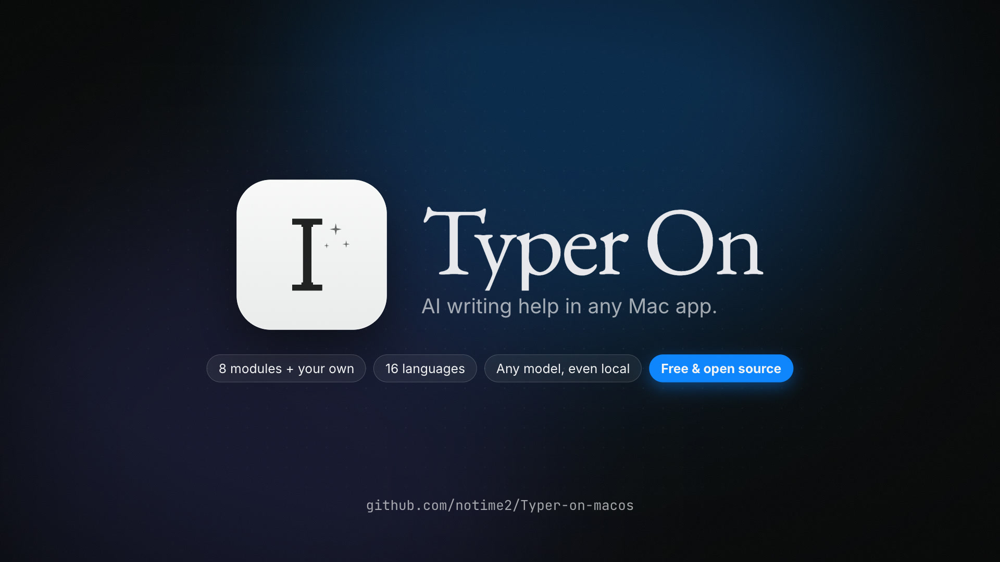
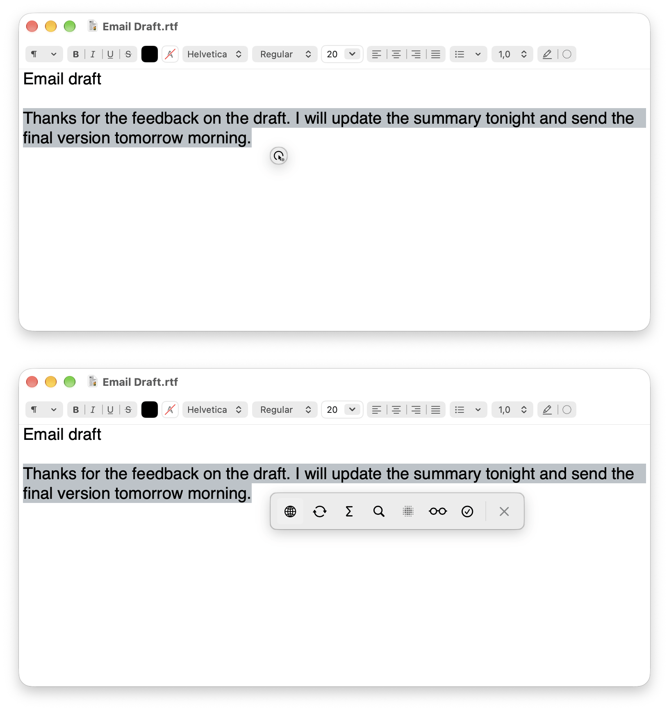
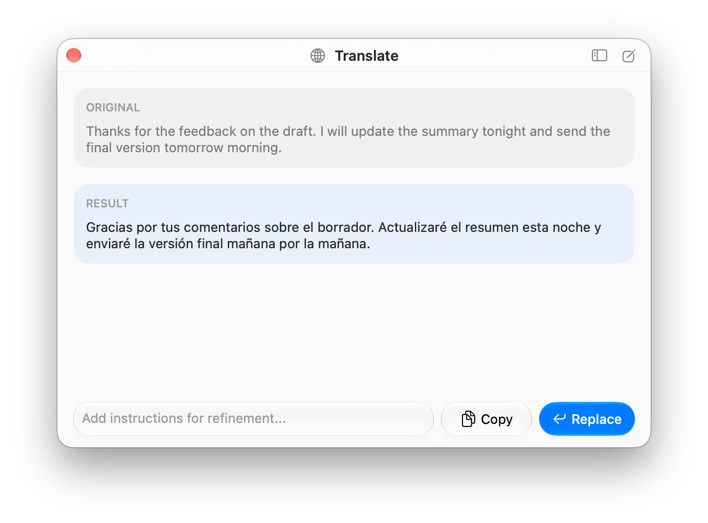
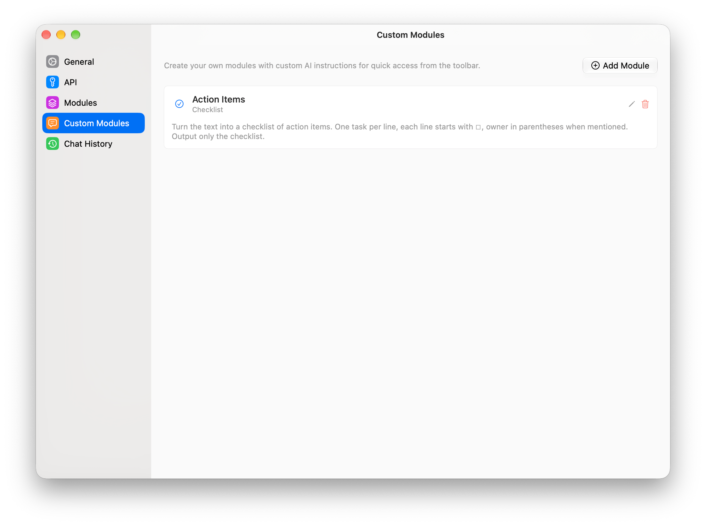
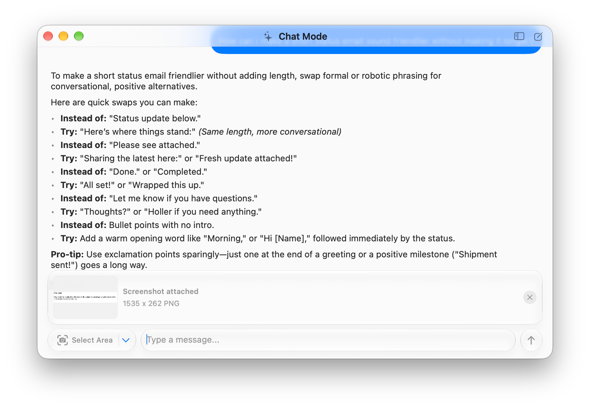
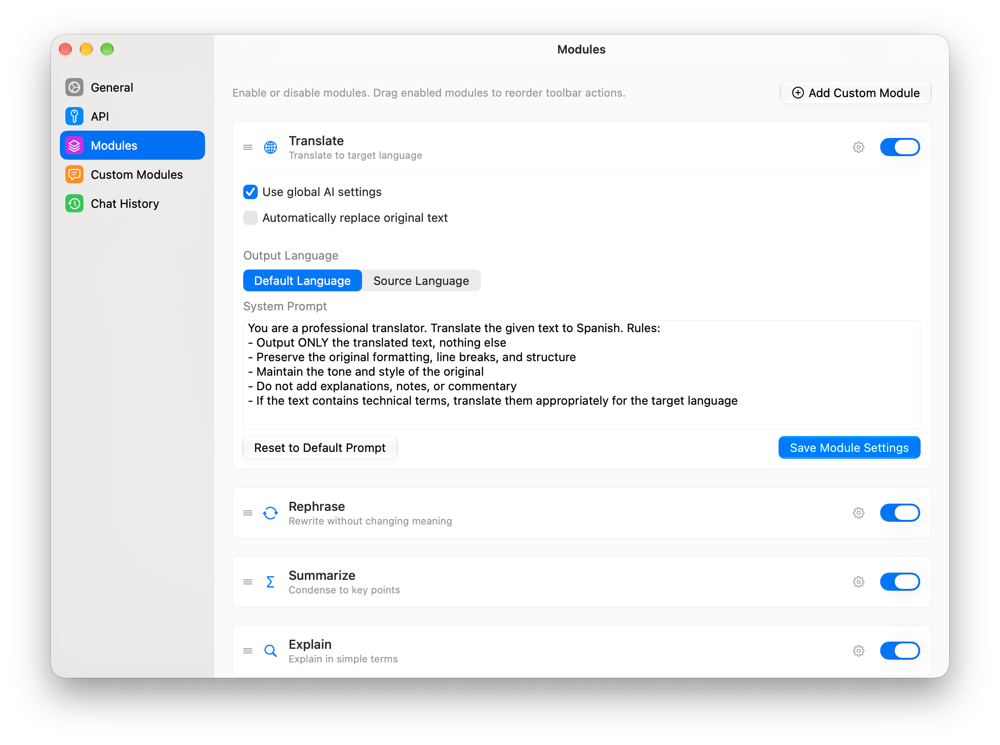
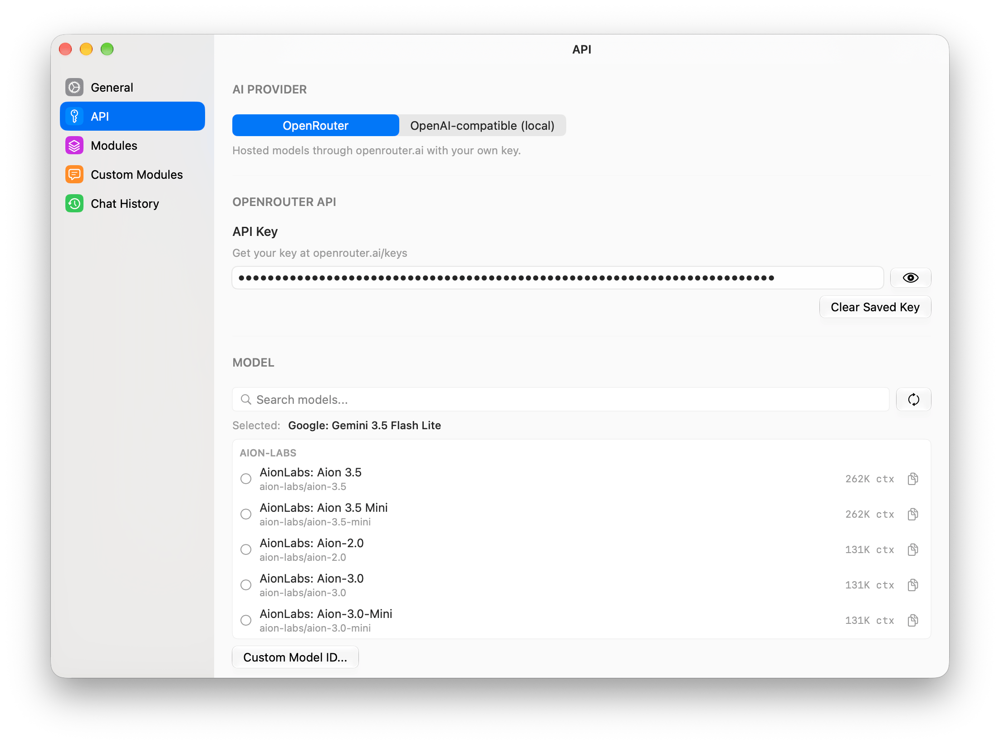

# Typer On

A native macOS menu-bar and float AI writing assistant. Select text in any app, choose
an action from a floating toolbar, and review or replace the result without
switching to a browser. A separate Chat Mode supports conversations, questions
about a screenshot, and image output with compatible models.



[▶ Watch the showreel with sound (MP4, 49 s)](docs/media/showreel.mp4)

Typer On uses your own [OpenRouter](https://openrouter.ai) API key, or a model
server you run yourself, such as Ollama or LM Studio. There is no Typer On
account or subscription: OpenRouter bills its model usage directly, and a local
server costs nothing to call.

[](LICENSE)


## Quick install

1. Download `TyperOn-<version>.dmg` from the
   [latest release](https://github.com/notime2/Typer-on-macos/releases/latest).
2. Open the DMG and drag **Typer On** into **Applications**.
3. The app is not notarized, so macOS blocks its first launch. Clear the
   quarantine flag once:

   ```bash
   xattr -dr com.apple.quarantine "/Applications/Typer On.app"
   ```

4. Open Typer On from Applications. It lives in the menu bar and has no Dock
   icon.
5. Grant Accessibility access, then add an OpenRouter key or a local endpoint in
   **Settings -> API**. See [First launch](#first-launch) for details.

Requires macOS Tahoe 26 or later. Each release also lists the DMG's SHA-256
checksum. Clear the quarantine flag only for a DMG downloaded from this
repository's releases page. After installing a new version, macOS may ask for
Accessibility access again. To build the app yourself, see
[Installation from source](#installation-from-source).

**Development status:** the project is configured as version `0.2.0`. Release
DMGs are built by GitHub Actions and, like local builds, are ad-hoc signed, not
notarized production releases. Automatic updates are not implemented. Compatibility depends on the source
app's Accessibility support; the presence of a capture profile or automated
test does not establish complete real-world compatibility.

## How it works

1. **Select text.** With auto-detection enabled, a compact trigger appears near
   the pointer when the app can read a selection containing at least three
   characters after trimming surrounding whitespace.
2. **Open the toolbar.** Hover or click the trigger. The default global shortcut
   `Option+F` (`⌥F`) explicitly captures the selection and opens the expanded
   toolbar. The menu bar also provides **Capture Selected Text** and quick actions.
3. **Choose a module.** Click its icon or use `⌘1` through `⌘9` for the first
   nine enabled modules, in their configured order.
4. **Review or replace.** The Processing window streams the result and lets you
   copy it, replace the original selection, or refine it with an additional
   instruction. A module can also be configured to replace text automatically.

When an explicit capture finds no selection, it opens Chat Mode instead.
**Open Chat Window** is also available directly from the menu bar. Selected text
added to Chat Mode is removable context; opening the window does not send it.





## Features

### Built-in and custom modules

| Module | Purpose |
|--------|---------|
| Translate | Translate the selected text into the default language, or into a fallback language when it is already in it |
| Grammar & Spelling | Correct spelling and grammar while preserving the original meaning |
| Rephrase | Rewrite the selection in different words |
| Adjust Tone | Change the tone or register |
| Summarize | Condense the selection |
| Explain | Explain the selected content |
| Fact Check | Label each claim as supported, unclear, likely incorrect, or opinion, without inventing sources |
| Chat Mode | Open a conversation, optionally with the selection as pending context |

In **Settings -> Modules**, enable or disable modules and drag enabled modules
into the desired order. This order is shared by the toolbar, its numbered
shortcuts, and menu bar quick actions.

Each module can inherit global AI settings or use its own API key and
model. You can edit its system prompt and choose **Default Language** or
**Source Language** for output. Model selection uses a searchable,
provider-grouped catalog and also accepts a manual model ID. **Use global
model** removes the model override without clearing a saved module key. Apply
module edits with **Save Module Settings**.

**Default Language** in **Settings -> General** follows your macOS language
until you pick one: the first language in your system list that Typer On
supports is used, otherwise English. Translate targets that language. When
the selection is already in it, Translate switches to English, or, when the
default is English, to the next supported language in your system list.

**Add Custom Module** opens the custom-module editor. Create a module with a
name, description, SF Symbol icon, and system prompt; it uses the same toolbar
and per-module configuration as the built-in modules.



### Review and automatic replacement

Review mode is the default. **Automatically replace original text** is an
opt-in setting for text-processing modules, including custom modules; it does
not apply to Chat Mode.

Automatic processing keeps the source editor focused and shows progress in the
floating panel. Cancel with its close control or `Esc` before replacement
starts. A successful replacement briefly shows a checkmark. Processing or
replacement failures open the normal Processing window so the result is not
silently lost.

Manual clipboard replacement provides **Undo Replace** in Typer On. Automatic
clipboard replacement relies on Undo in the source application.

### Chat, screenshots, and image output

Chat Mode supports multi-turn conversations, streaming Markdown, fenced code
blocks, and stopping or retrying a response. Scrolling up preserves your reading
position while text streams in.

With an image-input-capable model, attach a screenshot using **Select Area** or
the native macOS **Window or Display** picker. There is at most one pending
screenshot, and screenshot context and selected-text context can be removed
independently. Sending still requires a non-empty text prompt.

Screenshot controls depend on the resolved model's declared image-input
capability, not its name. Unknown or text-only models do not expose them.
Models with declared image output use the OpenRouter Images API; Chat can show
text, images, or both. Availability and results depend on the selected model
and provider.

Chat conversations and module runs are saved as a local chat history. The
sidebar button in the Chat and Processing header shows it, **New Chat** starts
an empty conversation, and the menu bar **Chat History** submenu opens recent
chats. **Settings -> Chat History** shows each transcript and can delete one
chat or clear everything. History lives only on this Mac, in
`~/Library/Application Support/Typer On/chat-history.json`, keeps the 500 most
recent conversations, and never stores screenshots or generated images: they
appear as "Image unavailable" in a reopened chat.



### Interface themes and menu bar

**Settings -> General -> Appearance -> Interface Theme** offers **Glass Dot**,
**Soft Accent**, **Monochrome Ink**, and **Editorial**. The selected theme applies
to the floating panel, Chat, and Processing, including already-open dialogs.
Light and dark palettes follow macOS. Native Liquid Glass is used only by Glass
Dot; the other themes use their own non-glass surfaces. Settings and onboarding
keep their standard appearance.

The menu bar provides Settings, capture, Chat, the chat history, pause/resume
auto-detection, enabled-module quick actions, model selection, API-key or local
endpoint and Accessibility status, and **Reopen Onboarding**. The global
shortcut is configurable; a registration conflict keeps the previous shortcut
active.


## Compatibility and replacement safety

Automatic capture reads Accessibility information on-device. It does not
silently copy the selection or take screenshots. When the source app does not
expose selected text, use `⌥F` or **Capture Selected Text** for the explicit
clipboard fallback. That fallback is not a guarantee that every app or field
can be captured or edited.

**Claude desktop, Zen and Chromium browsers expose selections only after
activation.** They hide their content from Accessibility clients until a client
requests it. Typer On sends that request only to Claude desktop
(`com.anthropic.claudefordesktop`), Zen (`app.zen-browser.zen`) and a fixed
list of Chromium browsers when it reads from them, and again after you return to
the app or relaunch it. Auto-detection can then read selections in Claude's input
field and responses and on web pages and page fields. The Chromium list covers
Google Chrome, which is verified, plus Chrome Beta/Dev/Canary, Microsoft Edge,
Brave, Arc, Vivaldi, Opera and Chromium, which use the same request but are not
verified. Yandex Browser ignores that request, so auto-detection does not work
there. Other Electron- and Gecko-based apps are not activated this way, because
changing their Accessibility state can add work or affect other tools. After you deselect text
in a Claude response, the trigger can take up to about half a second to hide.

Before replacement, Typer On revalidates the source app, focused element,
selected text, and captured ranges. A different selection, field, or external
foreground app blocks stale insertion. Returning from Typer On's own window is
allowed, but keeping a toolbar visible is not authorization to overwrite text.
Verified targets use direct Accessibility replacement where supported, with a
clipboard fallback when needed. Clipboard replacement rechecks the target
before pasting and does not overwrite an intervening external clipboard change
when restoring the previous clipboard.

**AyuGram has dedicated handling.** Read-only messages can retain explicitly
copied context when Accessibility does not expose their selection, while its
editable draft uses normal auto-detection. Replacement requires a freshly
verified editable draft and uses the clipboard path to preserve the app's Undo
behavior. The resulting draft must be shorter than 32,768 UTF-16 code units to
avoid AyuGram's large-paste file workflow. An unconfirmed replacement stays in
the Processing window rather than being reported as successful.

This handling applies only to AyuGram (`one.ayugram.AyuGramDesktop`); Telegram
and other Telegram clients do not inherit it.

## Requirements

- A Mac running **macOS Tahoe 26.0 or later**.
- Either an OpenRouter API key with network access, or a local OpenAI-compatible
  server such as Ollama or LM Studio. See [Local models](#local-models).
- **Accessibility** permission for selection capture and replacement.
- Screen-capture permission as required by macOS when using screenshot input.
- To build: **Xcode 26 or later** with its macOS SDK and **XcodeGen**.

The default AI backend is OpenRouter. `Settings -> API` can switch to any
OpenAI-compatible endpoint you run yourself. The local replay diagnostic described
below is neither of those: it is a fixture player, not an inference provider.

## Installation from source

The following builds the current repository; it does not depend on a published
binary release. Install Xcode and select its command-line tools before
building. The `brew` command below assumes Homebrew is already installed.

```bash
brew install xcodegen
git clone https://github.com/notime2/Typer-on-macos.git
cd Typer-on-macos/TyperOn
xcodegen generate
xcodebuild \
  -project TyperOn.xcodeproj \
  -scheme TyperOn \
  -configuration Release \
  -destination 'platform=macOS' \
  -derivedDataPath /tmp/TyperOnRelease \
  build
open "/tmp/TyperOnRelease/Build/Products/Release/Typer On.app"
```

For regular use, copy the **whole** `Typer On.app` bundle to `/Applications` and
launch that copy. Grant Accessibility permission to the exact copy you use.
A rebuilt or differently signed copy may need its Accessibility entry renewed.

You can also open the generated `TyperOn/TyperOn.xcodeproj` in Xcode and run the
`TyperOn` scheme. XcodeGen configuration lives in
[TyperOn/project.yml](TyperOn/project.yml). Use this Xcode app-bundle workflow
rather than treating the Swift package executable as the installed GUI app.

### First launch

1. Grant access in **System Settings -> Privacy & Security -> Accessibility**,
   then return to Typer On or use **Refresh** in its permission status.
2. In **Settings -> API**, pick a provider. For OpenRouter, save your key and
   select a model; for a local endpoint, enter its base URL, use **Test
   Connection**, and select a model. Keys are stored in the macOS Keychain.
3. Use **Open Chat Window** in onboarding, send a short message, and confirm
   that a response arrives. Then finish onboarding with **Get Started**.

The onboarding checklist checks Accessibility access, whether the active
provider is configured (a saved OpenRouter key, or a valid local base URL), and
whether its Open Chat action was used. It does **not** validate the key
with a successful AI response; the manual message above checks that separately.
Closing onboarding without completing it causes it to return on the next launch.
Typer On lives in the menu bar and has no Dock icon.

### Building a DMG

From the repository root:

```bash
./TyperOn/script/make_dmg.sh
```

The script generates the Xcode project, builds Release, and packages the full
app with `LICENSE` and `NOTICE`. Output is
`TyperOn/build/TyperOn-<version>.dmg`.

Published releases come from the same script.
[`.github/workflows/release.yml`](.github/workflows/release.yml) runs it on a
macOS runner when a `v<version>` tag is pushed (the tag must match
`MARKETING_VERSION` in `TyperOn/project.yml`), or when the workflow is started
manually, and attaches the DMG and its SHA-256 checksum to the release.

**These builds are ad-hoc signed and not notarized.** macOS may block a downloaded
copy. A warning is not proof that a download is safe or merely missing
notarization. Only for a build whose source and integrity you trust, you can
remove quarantine from that specific installed app:

```bash
xattr -dr com.apple.quarantine "/Applications/Typer On.app"
```

This bypasses quarantine protection; it does not verify the app's integrity.

## Settings

| Section | Controls |
|---------|----------|
| General | Launch at login, auto-detection, default language (follows the system language until set), interface theme, global shortcut, and Accessibility status |
| API | Provider choice (OpenRouter or OpenAI-compatible local), the key or base URL for it, searchable model catalog, temperature, and maximum output tokens |
| Modules | Enabled modules and order, per-module key/model, output-language mode, prompt overrides, and optional automatic replacement |
| Custom Modules | Create and edit custom prompt modules |
| Chat History | Saved chats and module runs: read a transcript, delete one chat, or clear everything |





## Local models

`Settings -> API` has two providers. **OpenRouter** is the default and is
unchanged. **OpenAI-compatible (local)** points the same Chat Completions
transport at a server you run, so nothing is sent to a hosted provider.

Fill in the base URL of that server's OpenAI-compatible API:

| Server | Base URL | Start it with |
|--------|----------|---------------|
| [Ollama](https://ollama.com) | `http://localhost:11434/v1` | `ollama serve`, then `ollama pull <model>` |
| [LM Studio](https://lmstudio.ai) | `http://localhost:1234/v1` | Start its local server from the app |

Then press **Test Connection**. It performs one `GET {base URL}/models` and
reports how many models the server offers, or the exact error. On success the
model picker lists those model IDs; pick one and press **Save**. An API key is
optional and only needed if your server requires one - it is stored in the
Keychain, never in preferences. A trailing slash, or a pasted
`/chat/completions` or `/models` URL, is normalized for you.

Plain `http` is allowed only for local and private-network addresses
(`localhost`, `*.local`, `127.0.0.0/8`, `::1`, `10/8`, `172.16/12`,
`192.168/16`). Any other `http` address is rejected with an inline error;
`https` is always allowed. The app declares `NSAllowsLocalNetworking` for this
and does not enable arbitrary loads.

What differs from OpenRouter while a local endpoint is active:

- The model list comes from your server, shows model IDs as-is, and is cached
  per base URL, so switching endpoints or providers never shows the other list.
- Local servers publish no modality metadata, so the Chat screenshot control
  stays hidden and image output is never requested.
- The provider is global. Per-module model IDs and per-module keys still apply,
  and each provider remembers its own selected model.
- The menu bar shows `Local Endpoint: <host>` instead of an API-key state.

## Privacy and data handling

There is no Typer On backend, account system, analytics, or remote telemetry.
Selection detection is local. Selected text and screenshots are sent for AI
processing when you invoke a processing module or send a chat message, not
merely because the floating toolbar or a chat window is shown.

**The app is not network-idle until the first prompt.** With a saved key, or with
a local endpoint configured, startup can refresh the model catalog of the active
provider. Catalog refresh and exact-model
metadata resolution also make network requests independently of text generation.
These requests do not include your selected text or screenshots. The current
network implementation is in
[AIEndpointService](TyperOn/Sources/AI/AIEndpointService.swift) and
[ModelCatalogService](TyperOn/Sources/AI/ModelCatalogService.swift).

Global and module API keys are kept in Keychain. Preferences, custom prompts,
module configuration, and the cached model list are stored locally in
`UserDefaults`. Chat conversations and module runs, including the selected text
they used, are saved to a local chat history file that you can clear in
**Settings -> Chat History**; screenshot attachments stay in memory and are
never saved. Capture logs contain
metadata rather than the selected text. Explicit fallback capture or replacement
can temporarily use the clipboard; screenshot capture does not use it.

With the local provider, the only host contacted is the endpoint you configured,
and the OpenRouter Images API is never used. Content sent to OpenRouter is also
subject to OpenRouter's and the selected provider's data policies. Typer On cannot guarantee their retention or handling
of that content. See [PRIVACY.md](PRIVACY.md) for the broader data-handling notes;
the network behavior summarized above includes startup catalog refresh and
per-model metadata requests.

## Development and testing

The app uses SwiftUI for views and AppKit for windows, the floating panel, and
the status item. Accessibility, clipboard, hotkeys, Keychain, and screenshots
use Apple system frameworks. There are no third-party runtime dependencies.
The app is not sandboxed; Hardened Runtime is enabled in the build configuration.

```text
TyperOn/
├── project.yml       XcodeGen app and test target configuration
├── Package.swift     Swift package manifest
├── Sources/
│   ├── App/          Environment, coordinators, and panel lifecycle
│   ├── Core/         Selection, replacement, clipboard, hotkeys, permissions
│   ├── AI/           Provider setup, OpenRouter and local requests, catalog, streaming, replay
│   ├── Modules/      Built-in modules, custom prompts, and registry
│   ├── UI/           Toolbar, Chat, Processing, Settings, onboarding, shared views
│   └── Utilities/    Logging, preferences, and extensions
├── Resources/        App icon, Info.plist, and entitlements
├── Tests/            Automated tests
└── script/           Local build/run and DMG packaging
```

### Local build and run

From the repository root:

```bash
cd TyperOn
xcodegen generate
./script/build_and_run.sh
```

The helper stops the existing app, builds Debug into `/tmp/TyperOnRun`, and
launches that bundle. It also supports `--debug`, `--logs`, `--telemetry`, and
`--verify`. Here `--telemetry` streams local unified logs; it does not enable
remote reporting. The helper does not run XcodeGen itself, so regenerate the
project after adding, removing, or renaming source files.

### Automated tests

From the repository root:

```bash
cd TyperOn
xcodegen generate
xcodebuild \
  -project TyperOn.xcodeproj \
  -scheme TyperOn \
  -configuration Debug \
  -destination 'platform=macOS' \
  -derivedDataPath /tmp/TyperOnTests \
  test
```

Do not run build and test concurrently against the same DerivedData directory.
Check the test summary for a non-zero executed-test count; a command that
selects no tests is not validation. Automated tests do not replace manual checks
of selection, replacement, focus, Undo, permissions, or UI behavior in other apps.

### Local streaming replay

To exercise Chat and Processing with repeatable synthetic text, create a JSON
fixture such as:

```json
{"chunks":["# Local replay\n\n","Synthetic response.\n"],"intervalMilliseconds":10}
```

Quit any normal instance, then launch the exact built Release executable:

```bash
"/tmp/TyperOnRelease/Build/Products/Release/Typer On.app/Contents/MacOS/Typer On" \
  --qa-stream-replay /absolute/path/to/fixture.json
```

Replay replaces AI streaming with local fixture data and disables remote model
catalog and metadata requests. Its diagnostic launch does not alter saved
models or credentials. Explicit preference edits can still persist, and normal
text-replacement actions remain enabled: use a scratch document, not important
source text. Replay is not a disposable settings sandbox. Missing or invalid
fixtures fail closed with exit code 64 rather than making a network request.

Restart without the argument for normal operation. Label measurements
`Release/live`, `Release/replay`, or `test-host/replay`: replay tests rendering
workloads, not network latency, model quality, or cross-application compatibility.

## Contributions

The project does not accept outside pull requests; see
[CONTRIBUTING.md](CONTRIBUTING.md). Bug reports and feature ideas can be filed as
[issues](https://github.com/notime2/Typer-on-macos/issues). Report security problems
privately as described in [SECURITY.md](SECURITY.md), not in public issues.

## License

Typer On is free and open source, licensed under the
[Apache License 2.0](LICENSE). See [NOTICE](NOTICE) for attribution and
[CONTRIBUTING.md](CONTRIBUTING.md) for the project's fork policy.

Copyright 2026 Maksim Nikolaev.
